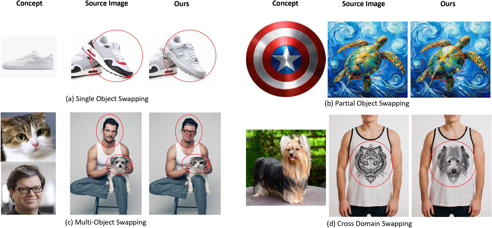
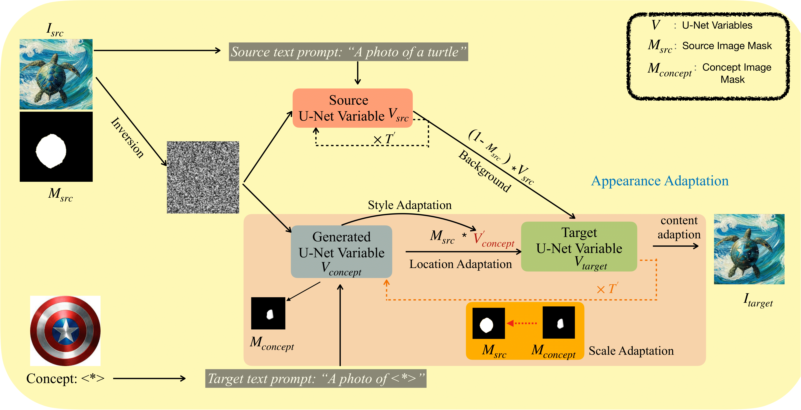

# SwapAnything: Enabling Arbitrary Object Swapping in Personalized Visual Editing (ECCV 2024)

[Jing Gu](https://g-jing.github.io/), [Yilin Wang](https://yilinwang.org/), [Nanxuan Zhao](http://nxzhao.com/), [Wei Xiong](https://wxiong.me/), [Qing Liu](https://qliu24.github.io/), [Zhifei Zhang](https://zzutk.github.io/), [He Zhang](https://sites.google.com/site/hezhangsprinter/), [Jianming Zhang](https://cs-people.bu.edu/jmzhang/), [HyunJoon Jung](https://polaris79.wixsite.com/hjung), [Xin Eric Wang](https://eric-xw.github.io/)

[[Project Page](https://swap-anything.github.io/)] [[Paper](https://arxiv.org/abs/2404.05717)]



## Model Architecture


## TODO
- [ ] Release demo  
- [x] Release code  

## Crop-Edit-Paste Pipeline
Since swap-anything could preserve the background perfectly, we could avoid the image size and ratio limitation of the backbone image diffusion model. Now we could edit object of any size in image of any size! Swap-anything support personalized object swapping, general object swapping, and object insertion.


## 1. Git clone this repo
```bash
git clone https://github.com/eric-ai-lab/swap-anything.git
cd swap-anything
```

## 2. Image and Mask Preparation
1. For a source image `filename.jpg`, please create `source_image/filename/`:
   ```bash
   mkdir source_image/filename
   ```

2. Put binary mask image into `source_image/filename`.
The mask image name should be `filename_mask.png`.

We accept general source image types like `.jpg`, `.jpeg`, `.png`. However, make sure the mask is in `.png` format so that the code can find the mask according to pattern matching. Please refer to the provided example in `source_image`.


## 3. Train DreamBooth Model to Include the New Concept (Optional)
1. Our method also works with other concept learning methods such as CustomDiffusion, Text Inversion, etc.
2. You do not need this step for general object swapping.

### Package Installation

Follow the installation instructions from [Hugging Face Diffusers v0.25.0](https://github.com/huggingface/diffusers/tree/v0.25.0):

```bash
cd diffusers
pip install -e .
cd examples/dreambooth
pip install -r requirements.txt
```

### Concept Data
Place images of the target concept into `dreambooth_data/{INSTANCE_NAME}`. The more images you provide, the better the results. Optimal performance is typically achieved with around 20 images.

### Training DreamBooth
In script `train_dreambooth.sh`
1. Set `INSTANCE_NAME` to the name of the image folder.
2. Set `CLASS_NAME` to the class of the target object.

Run the following command to start training:

```bash
./train_dreambooth.sh
```

The script will generate checkpoints in the folder `checkpoints/checkpoint_$INSTANCE_NAME-$Model_IDENTITY`.

## 4. Editing Image


- **Personal object swapping**: 
  ```bash
  python main.py --config config_personal_swap.yml
  ```
  To perform a personalized swap, set `concept_model_path` to the folder containing the diffusion model with the learned concept. Our model uses DreamBooth, so update `source_subject_word` with the object you want to replace and adjust `source_prompt` accordingly. Similarly, modify `target_subject_word` and `target_prompt` based on the tokens used during DreamBooth training.

- **General object swapping**: 
  ```bash
  python main.py --config config_general_swap.yml
  ```
  For general object swaps (non-personalized), you can use `"runwayml/stable-diffusion-v1-5"` as the `concept_model_path`.

- **Object insertion**: 
  ```bash
  python main.py --config config_insertion.yml
  ```
  For object insertion, follow the same process as the swapping task. The difference is to set `source_subject_word` to `'nothing'` and `source_prompt` to `"a photo of nothing"`.

### Output
The editing results will be in the folder `photoswap_real_output_{cuda_id}`. In each `sample_*` subfolder, you will find the source image, edited image, mask, along with their cropped versions, and a JSON file containing all variable information. 

We also provide a webpage in the `html` folder so you can browse all results at once.


### config*.yml expanation
| Variable               | Value                          | Description                                  |
|------------------------|--------------------------------|----------------------------------------------|
| `cuda_id`              | `0`                            | ID of the CUDA device.                       |
| `do_not_crop`          | `False`                        | Use the whole image when `True`.             |
| `pre_defined_crop`     | `[]`                           | Crop coordinates `[x1, y1, x2, y2]`.         |
| `blend_width`          | `20`                           | Width of the blend area.                     |
| `total_diffusion_steps`| `50`                           | Diffusion steps.                             |
| `guidance_scale`       | `7.5`                          | Guidance scale for diffusion.                |
| `source_image_path`    | `'source_image/person1.jpg'`   | Source image path.                           |
| `source_subject_word`  | `'person'`                     | Source subject word.                         |
| `source_prompt`        | `"a photo of a person"`        | Source image prompt.                         |
| `target_subject_word`  | `'sks'`                        | Target subject word.                         |
| `target_prompt`        | `"a photo of sks man"`         | Target image prompt.                         |
| `concept_model_path`   | `'checkpoints_folder'`         | Concept model path.                          |
| `self_output_range`    | `[0.1, 0.3, 0.5, 0.7]`         | Self-attention output range.                 |
| `self_map_range`       | `[0.0]`                        | Self-attention map range.                    |
| `cross_map_range`      | `[0.1, 0.3, 0.5, 0.7]`         | Cross-attention map range.                   |
| `add_zero_to_range`    | `True`                         | Add zero to range.                           |
| `end_blend`            | `52`                           | End point for blending.                      |
| `is_show_result`       | `True`                         | Show result in notebook mode if `True`.      |


## A Few Tips for Better Performance
1. For face swapping tasks, usually a higher variable swapping ratio yields better performance.
2. If the swapping results show significant shape deformation, it could be due to the automatic cropping issue. Manually input the crop coordinates `x1, y1, x2, y2` so that `(x2 - x1) ≈ (y2 - y1)`. This is also useful for detailed manipulation. For example:
   - Setting `(x2 - x1) > (y2 - y1)` will make the face wider.
   - Setting `(x2 - x1) < (y2 - y1)` will make the face narrower horizontally.
3. If the swapping result is too similar to the source image and does not transfer the target identity, try decreasing the swapping ratio. If the result contains artifacts or is not harmonious, you may want to increase the swapping ratio.


## Citation


```
@inproceedings{gu2024swapanything,
      title={SwapAnything: Enabling Arbitrary Object Swapping in Personalized Visual Editing}, 
      author={Jing Gu and Yilin Wang and Nanxuan Zhao and Wei Xiong and Qing Liu and Zhifei Zhang and He Zhang and Jianming Zhang and HyunJoon Jung and Xin Eric Wang},
      booktitle={ECCV},
      year={2024}
}
```
